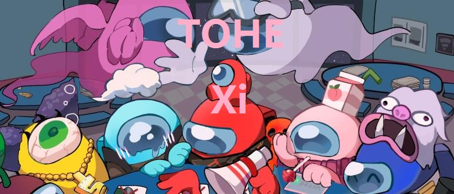

<h1 align="center">~ TownofHost Edited Xi ~</h1>

## Language
[English](https://github.com/TOHEX-Official/TownOfHostEdited-Xi/blob/TOHEXG/README-EN.md)

 
 

  
> ### 关于这个模组
>
> 该模组不隶属于Among Us或 Innersloth LLC，其中包含的内容未经 Innersloth LLC 认可或以其他方式赞助 此处包含的部分材料是 Innersloth LLC 的财产。 © Innersloth LLC.
>

  -------------------------------------------------------------

  
   
  相关网址
  

  
 
  
### 最新版本：
支持AmongUs v2023.7.11及以上版本

最新版本：v2.0.0

**TOHE 结束支持在 v2.3.6.**  
**但！TOHEX延续了TOHE！**

## 部分职业想法来源

[Town Of Host](https://github.com/tukasa0001/TownOfHost) 
[Town Of Host Edited](https://github.com/KARPED1EM/TownOfHostEdited) 
[Town Of Host_Y](https://github.com/Yumenopai/TownOfHost_Y) 
[Town Of Host : The Other Roles](https://github.com/music-discussion/TownOfHost-TheOtherRoles) 
[Super New Roles](https://github.com/ykundesu/SuperNewRoles) 
[Town Of Host-ReEdited](https://github.com/Loonie-Toons/TownOfHost-ReEdited) 
[Town Of Us](https://github.com/Loonie-Toons/TownOfHost-ReEdited) 
[Town-Of-Us-R](https://github.com/eDonnes124/Town-Of-Us-R) 
[Foolers Mod](https://github.com/MengTube/Foolers-Mod) 
[Nebula on the Ship](https://github.com/Dolly1016/Nebula) 
[The Other Roles](https://github.com/TheOtherRolesAU/TheOtherRoles) 
[The Other Roles: GM Edition](https://github.com/yukinogatari/TheOtherRoles-GM) 
[The Other Roles: GM Haoming Edition](https://github.com/haoming37/TheOtherRoles-GM-Haoming) 
[QQ频道](https://pd.qq.com/s/1la0nbwal)的**玩家**们 
**感谢各模组的优秀想法，是这些模组造就了我们** 
**更要感谢支持我们的玩家，是你们让我们拥有做下去的动力！**

# 特别鸣谢

>
>### :star: [Town Of Host](https://github.com/tukasa0001/TownOfHost) :
>
> - 作者：[tukasa0001](https://github.com/tukasa0001)
> - 我们的模组基于Town Of Host
>
>### :star: [Town Of Host Edited](https://github.com/KARPED1EM/TownOfHostEdited) :
> 
> - 作者：[KARPED1EM](https://github.com/KARPED1EM)
> - 我们的模组是Town Of Host Edited的分支
> - **感谢TOHE作者咔皮呆的近10万行代码，这为我们的模组建立了极为优秀的基础**
>
>### :star: [Town Of Host_Y](https://github.com/Yumenopai/TownOfHost_Y) :
> 
> - 作者：[Yumenopai](https://github.com/Yumenopai)
> - 许多职业想法
> - 部分职业来源：监管者，呪狼，工作狂，贪婪者 ，潜藏者
> - 7.11及以后版本模组游戏公告
>
>### :star: [Town Of Host : The Other Roles](https://github.com/music-discussion/TownOfHost-TheOtherRoles) :
>
> - 作者：[Music Discussion](https://github.com/music-discussion)
> - 许多职业想法
> - 驱逐确认
> - 分割RPC包
> - 部分职业来源：模仿者(杀手)
>
>### :star: [Super New Roles](https://github.com/ykundesu/SuperNewRoles) :
> 
> - 作者：[ykundesu](https://github.com/ykundesu)
> - 开发团队界面
> - 切换马模式 
> - 查询模组
> - 自定义按钮
>
>### :star: [Town Of Plus](https://github.com/tugaru1975/TownOfPlus) :
> 
> - 作者：[tugaru1975](https://github.com/tugaru1975)
> - 千里眼
>
>### :star: [Revolutionary Host Roles](https://github.com/sansaaaaai/Revolutionary-host-roles) :
> 
> - 作者：[sansaaaaai](https://github.com/sansaaaaai)
> - 模组设定界面
>  
>### :star: [Town Of Host-ReEdited](https://github.com/Loonie-Toons/TownOfHost-ReEdited) :
> 
> - 作者：[Loonie-Toons](https://github.com/Loonie-Toons)
> - 许多职业想法
> - 部分职业来源：医生，分散者，研究员
>  
>### :star: [To-Hope](https://gitee.com/xigua_ya/to-hope) :
> 
> - 作者：[Night_瓜](https://gitee.com/xigua_ya)
> - 7.11及以后版本自定义按钮
> 
# 制作团队

>> ***开发者：*** 
>[是喜欸]()- **主要开发者** - 
>[Night_瓜]()- **开发者** - 
>[Slok7565](https://github.com/Slok7565)- **开发者&英语翻译** - 
>[Zeyan]()- **开发者&英语翻译** - 
>
>> ***图标绘制：*** 
>[小黄117]()- **职业栏图标绘制** - 
